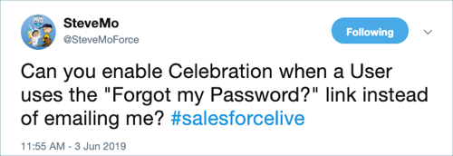
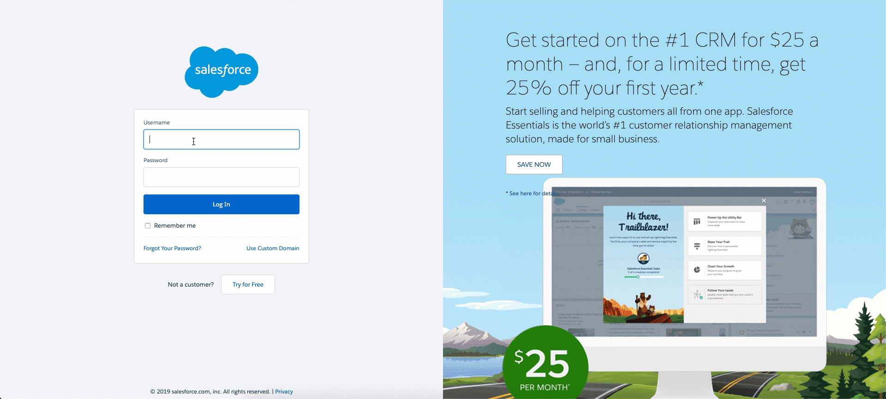

# Login Flow Confetti

Humorously inspired by [SteveMo](https://twitter.com/SteveMoForce/status/1135590776036057089),
I developed a [Login Flow](https://developer.salesforce.com/docs/atlas.en-us.securityImplGuide.meta/securityImplGuide/security_login_flow_create.htm)
that determines if the user's most recent password reset was done by themselves and not issued by the System Administrator.

If yes, then the user is greeted with confetti. 🎉

If no, then the user is logged in like normal.






# Installation

1. Open a command line terminal on your machine.
    * On Windows, click **Start**, type `PowerShell`, and then click **Windows PowerShell**.
    * On macOS, press `CMD` + `SPACEBAR` to open **Spotlight Search**, type `terminal`, and then click **Terminal.app**.

2. [Clone or download](https://help.github.com/en/articles/cloning-a-repository) this repository to your machine by running the following commands from your terminal.

```
git clone https://github.com/douglascayers/sfdx-login-flow-confetti.git
cd sfdx-login-flow-confetti
```

3. [Install the Salesforce CLI](https://developer.salesforce.com/tools/sfdxcli).

4. Authorize the CLI with your org (e.g. [Trailhead Playground](https://trailhead.salesforce.com/content/learn/modules/trailhead_playground_management) or free [Developer Edition](https://developer.salesforce.com/signup?d=70130000000td6N) org) by running the following commands from your terminal.

```
sfdx force:auth:web:login -s -a confetti
```

5. Deploy this project to your Salesforce org by running the following commands from your terminal.

> No test coverage is provided, please don't use this in production environments.

```
sfdx force:source:deploy -p force-app -w 10
```

6. From Setup, assign the **Login Flow Confetti** permission set (or grant access to the `LoginFlowConfettiPage` visualforce page to profiles) to users who will interact with this login flow.


# Getting Started

1. From Setup, enter `login` into the Quick Find box, then click **Login Flows**.

2. Click **New**, then enter the details:
    a. Type: **VisualForce Page**
    b. Name: `Login Flow Confetti`
    c. VisualForce Page: `LoginFlowConfettiPage`
    d. User License: *choose a license*
    e. Profile: *choose a profile*

3. Click **Save**.

4. Using a user with the selected profile assigned to your Login Flow you just created, [self-request a password reset](https://login.salesforce.com/secur/forgotpassword.jsp).

5. Click the link in your email to reset your password.

6. If upon logging in to Salesforce you don't see the Login Flow, try logging out and in again. If you still don't see it, ensure your user's profile is assigned the Login Flow.


# Credits

[Doug Ayers](https://douglascayers.com/) develops and maintains the project.

[Steve Molis](https://twitter.com/SteveMoForce) inspired this silly little endeavor.


# Disclaimers

This is a silly project with a silly purpose for use among friends.
I do not endorse the use of this Login Flow in production environments
or with users who have not consented to such tomfoolery.
